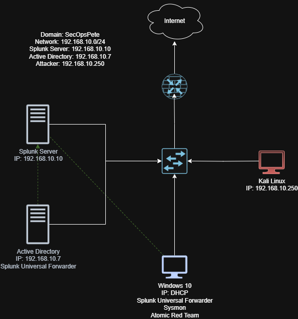

# 🏗️ Active Directory Lab

**Analyst:** Peter Van Rossum  
**Date Range Built:** September 2025  
**Environment:** Home Lab (Virtualized)  
**Core Components:** Windows Server (Domain Controller), Windows 10 Client, Ubuntu Server (Splunk SIEM), Kali Linux Attack Machine 

⚡This Active Directory Lab walkthrough is based on the excellent [MyDFIR "Active Directory Project (Home Lab)" YouTube series](https://www.youtube.com/@MyDFIR), with additional notes, detections, and explanations written from my own build process.

---

## ⚠️ Limitations & Considerations

This lab is a **controlled, isolated environment** I built for training. While the setup mirrors many real-world enterprise components, there are important considerations:

- Configurations are sometimes intentionally insecure (e.g., weak passwords, open RDP) to simulate adversary actions.  
- All attacks are conducted against my own lab systems using a NAT/Host-Only virtual network.  
- Telemetry will not perfectly match enterprise-scale environments but is close enough for learning SOC workflows.  

The purpose is not production hardening, but **hands-on experience with detection engineering**.

---

## 🎯 Objective

My goal was to create a **mini-enterprise Active Directory environment** where I could:

- Stand up a Windows domain (users, policies, DNS).  
- Deploy Sysmon and Splunk Universal Forwarder to capture endpoint telemetry.  
- Send that telemetry into Splunk for searching, dashboards, and alerts.  
- Run controlled attacks from Kali Linux and Atomic Red Team.  
- Detect those attacks using SPL queries and Event IDs.  

This project mirrors what a SOC analyst or detection engineer would do in the field.

---

# 🧭 Lab Build Timeline and Findings

## ✅ Part 1 – Planning

I began by defining the environment and requirements:

- **Virtual Machines:**  
  - `DC01`: Windows Server 2019 (Domain Controller)  
  - `WIN10-CLIENT`: Windows 10, joined to the domain  
  - `SPLUNK`: Splunk Enterprise server  
  - `KALI`: Kali Linux attacker box  

- **Networking:** NAT/Host-Only for safety.  
- **Static IPs:**  
  - DC01 → 192.168.10.5  
  - WIN10-CLIENT → 192.168.10.10  
  - SPLUNK → 192.168.10.20  
  - KALI → 192.168.10.30  

**Why this matters:**  
Upfront planning avoids confusion later. With static IPs and a clear design, Splunk correlation becomes easier and my detections remain consistent.

 

### 🔑 Why Active Directory Is Central to This Lab

Active Directory is the backbone of this entire project. It’s where user accounts and groups live, how permissions are decided, and how policies are enforced across the environment. Every logon attempt, privilege check, and security policy begins with AD.  

That makes AD both the **target** attackers go after and the **source** of the signals defenders rely on. By building my lab around AD, I created a realistic enterprise core — the place where identity, access, and security controls all intersect.

---

## ✅ Part 2 – Building the Environment

### Windows Server (DC01)
- Installed Windows Server.  
- Renamed host to `DC01`.  
- Promoted it to a Domain Controller with forest `lab.local`.  
- DNS installed automatically with AD DS role.  

### Windows 10 Client
- Installed Windows 10.  
- Joined `lab.local` domain.  
- Verified login with domain credentials.  

### Splunk Enterprise
- Installed Splunk Enterprise (free 500MB/day license).  
- Verified access to Splunk Web UI.  

### Kali Linux
- Updated repositories.  
- Installed Hydra, Crowbar, and CrackMapExec.  
- Prepared wordlists for brute force testing.  

**Why this matters:**  
At this stage, I had a functioning enterprise-like network: a domain, a workstation, a SIEM, and an attacker. This forms the foundation for detection engineering.

---

## ✅ Part 3 – Active Directory & Telemetry

### AD Configuration
- Created user accounts, including a weak “testuser” account.  
- Applied GPOs:  
  - Password complexity.  
  - Audit policy for logon and process creation.  
  - Enabled Remote Desktop for RDP attack simulations.  

### Sysmon Deployment
- Installed Sysmon on DC01 and WIN10-CLIENT.  
- Used SwiftOnSecurity’s Sysmon configuration for comprehensive telemetry.  

### Splunk Universal Forwarder
- Installed Splunk UF on both Windows hosts.  
- Configured `inputs.conf` to forward critical logs:

    [WinEventLog://Application]  
    index = endpoint  
    disabled = false  

    [WinEventLog://Security]  
    index = endpoint  
    disabled = false  

    [WinEventLog://System]  
    index = endpoint  
    disabled = false  

    [WinEventLog://Microsoft-Windows-Sysmon/Operational]  
    index = endpoint  
    disabled = false  
    renderXml = true  

Restarted the SplunkForwarder service to apply changes.

**Why this matters:**  
Telemetry is everything. Without Sysmon + Security logs flowing into Splunk, there’s nothing to analyze or detect. This step was about wiring my environment so Splunk could “see.”

---

## ✅ Part 4 – Splunk Setup & Detection Engineering

### AD User Accounts & Permissions
Before wiring logs into Splunk, I needed realistic users and groups in AD so my detections had meaningful context.

- **Users:**  
  - `testuser` — weak password, used only for brute-force tests.  
  - `analyst.peter` — everyday non-admin account.  

- **Groups:**  
  - `SecOps-Lab-Users` — standard users.  
  - `SecOps-Remote-Desktop` — added to the client’s **Remote Desktop Users** local group so I could RDP without full admin rights.  

**Why this matters:**  
Creating distinct accounts and assigning RDP rights by group ensures Splunk logs show the *who* and *how* behind logon events. It also mirrors real enterprises where access is role-based, not just handed out via local admin.

---

### Splunk Index & Ingestion
On the Splunk server, I created a dedicated index:

- **Index Name:** `endpoint`  
- **Data Type:** Events  

I verified events were flowing with:

    index=endpoint | stats count by host, source

Expected sources included:  
- `WinEventLog:Security`  
- `WinEventLog:System`  
- `WinEventLog:Application`  
- `WinEventLog:Microsoft-Windows-Sysmon/Operational`  

---

### Key Event IDs
**Windows Security Logs:** 4625 (failed logon), 4624 (successful logon), 4672 (privileged logon), 4688 (process creation).  
**Sysmon Logs:** 1 (process create), 3 (network connection), 7 (image loaded), 11 (file created), 13 (registry modification), 22 (DNS query).  

---

### Core SPL Queries
*(These come from common SOC playbooks, not directly from MyDFIR — they extend the lab into detection engineering.)*

**Failed logons by user/IP:**

    index=endpoint source="WinEventLog:Security" EventCode=4625
    | stats count BY TargetUserName, IpAddress
    | sort - count

**Brute-force success correlation:**

    index=endpoint source="WinEventLog:Security" EventCode IN (4625,4624)
    | eval outcome=if(EventCode=4625,"fail","success")
    | stats count AS attempts, values(outcome) AS outcomes by TargetUserName, IpAddress
    | where attempts>=10 AND mvfind(outcomes,"success")>=0

**Suspicious PowerShell activity:**

    index=endpoint source="WinEventLog:Microsoft-Windows-Sysmon/Operational" EventCode=1 Image="*\\powershell.exe"
    | eval encoded=if(match(CommandLine,"(?i)-enc"),"Base64_Encoded","Plain")
    | table _time, host, User, CommandLine, encoded

---

### Dashboards & Alerts
I built a dashboard with panels for failed logons, suspicious PowerShell, and file drops in Temp/AppData.  
I also set an alert: **“Brute Force Succeeded”** — triggered when failures are followed by a success within 15 minutes.  

**Why this matters:**  
By the end of Part 4, Splunk wasn’t just collecting logs — it was surfacing meaningful detections tied back to specific users and accounts I had configured in AD.

---

## ✅ Part 5 – Attack & Detect

With the environment built and logs flowing into Splunk, I wanted to put it to the test. This stage is where I stopped simply “collecting logs” and began **simulating adversary behavior** against my own AD domain to validate whether my detections could catch it.

---

### 🔐 Brute Force with Kali

I began with something noisy but classic: brute forcing remote services. From my Kali VM, I targeted the Windows client using both RDP and SMB.  

**RDP brute force (Crowbar):**

    sudo crowbar -b rdp -s 192.168.10.10/32 -u testuser -C passwords.txt

- `-b rdp` → protocol to attack.  
- `-s 192.168.10.10/32` → the Windows 10 client target.  
- `-u testuser` → my deliberately weak lab account.  
- `-C passwords.txt` → supplied wordlist.  

**SMB brute force (Hydra):**

    hydra -L users.txt -P passwords.txt smb://192.168.10.10 -V -f

- `-L users.txt` → list of usernames to test.  
- `-P passwords.txt` → password wordlist.  
- `-V` → verbose output.  
- `-f` → stop when a valid login is found.  

**Expected telemetry in Splunk:**  
- A burst of **4625 (failed logon)** events for each attempt.  
- If the password hits, a **4624 (successful logon)** event appears.  
- If that account has elevated rights, a **4672 (special privileges assigned)** will follow.  

**Why this matters:**  
This brute-force test generates a high volume of authentication noise, giving me a chance to validate that Splunk searches and alerts built in Part 4 actually trigger on real attack activity. It’s the SOC analyst’s bread and butter: “lots of failures, then one success.”

---

### 🎭 Atomic Red Team (ART)

After brute force, I turned to **Atomic Red Team (ART)** to simulate more targeted, stealthy techniques. ART provides repeatable test cases that map directly to MITRE ATT&CK, so I could measure detections against recognized adversary behaviors.  

**Install ART (PowerShell):**

    Set-ExecutionPolicy Bypass -Scope Process -Force
    iwr https://github.com/redcanaryco/atomic-red-team/raw/master/get-atomics.ps1 -UseBasicParsing -OutFile get-atomics.ps1
    .\get-atomics.ps1

This pulled down the framework and made `Invoke-AtomicTest` available on the Windows client.

---

#### Test 1: T1059.001 – PowerShell Encoded Command
Simulates an attacker using encoded PowerShell to obfuscate intent.

    Invoke-AtomicTest T1059.001 -TestNumbers 1 -Path "C:\AtomicRedTeam"

**Expected logs:**  
- **Sysmon Event ID 1 (process creation)** showing `powershell.exe` with `-enc` in the command line.  

---

#### Test 2: T1547.001 – Registry Run Key Persistence
Simulates persistence via `HKCU\Software\Microsoft\Windows\CurrentVersion\Run`.

    Invoke-AtomicTest T1547.001 -TestNumbers 1 -Path "C:\AtomicRedTeam"

**Expected logs:**  
- **Sysmon Event ID 13 (registry modification)** pointing to the `Run` key.  

---

#### Test 3: T1105 – Ingress Tool Transfer
Simulates an attacker pulling down a tool from the internet.

    Invoke-AtomicTest T1105 -TestNumbers 1 -Path "C:\AtomicRedTeam"

**Expected logs:**  
- **Sysmon Event ID 11 (file create)** for the dropped file.  
- **Sysmon Event ID 3 (network connection)** showing the outbound request.  

---

**Cleanup:**  
To avoid lingering artifacts, I ran:

    Invoke-AtomicTest T1547.001 -TestNumbers 1 -Path "C:\AtomicRedTeam" -Cleanup

---

### 📊 Splunk Detection Queries

To validate these tests, I pivoted into Splunk with SPL searches aligned to each scenario:

**Encoded PowerShell (T1059.001):**

    index=endpoint EventCode=1 Image="*\\powershell.exe" CommandLine="*-enc*"
    | table _time, host, User, CommandLine

**Registry persistence (T1547.001):**

    index=endpoint EventCode=13
    | regex TargetObject="(?i)\\Software\\Microsoft\\Windows\\CurrentVersion\\Run"
    | table _time, host, TargetObject, Details

**File drop + network connection (T1105):**

    index=endpoint (EventCode=11 OR EventCode=3)
    | table _time, host, EventCode, Image, CommandLine, TargetFilename, DestinationIp, DestinationPort

---

### 🧠 Why this matters

Part 5 transformed the lab from *log collection* to a true **defender feedback loop**:  
1. I simulated real-world adversary behavior (brute force, obfuscated PowerShell, persistence, and tool transfer).  
2. My Sysmon + Splunk pipeline captured the artifacts.  
3. Custom SPL queries surfaced those behaviors clearly in dashboards and alerts.  

This gave me confidence that if a similar attack played out in production, the right telemetry and detection logic would be there to catch it.

---

### 📌 MITRE ATT&CK Mapping

| Technique ID | Name                               | Category       | Test Description                          |
|--------------|------------------------------------|----------------|-------------------------------------------|
| **T1110**    | Brute Force                        | Credential Access | Kali Crowbar/Hydra attacks against RDP & SMB |
| **T1059.001**| PowerShell (Encoded Command)       | Execution      | Encoded PowerShell to obfuscate commands   |
| **T1547.001**| Registry Run Keys / Startup Folder | Persistence    | Registry modification for logon persistence |
| **T1105**    | Ingress Tool Transfer              | Command & Control | Downloading tools/files from remote sources |

---

# 📊 Deliverables

By the end of this lab, I had:
- A functional AD domain (`lab.local`).  
- Sysmon + Splunk UF sending telemetry to Splunk.  
- SPL queries that detect brute force, encoded PowerShell, persistence, and file drops.  
- A Splunk dashboard with real attack telemetry.  
- Documented adversary simulations with Atomic Red Team.  

---

# ✅ Progress Checklist

- [x] VMs created (Server, Client, Splunk, Kali).  
- [x] AD configured (domain, users, GPOs).  
- [x] Sysmon + UF deployed.  
- [x] Splunk index created and logs verified.  
- [x] Core SPL queries tested.  
- [x] Dashboard panels built.  
- [x] Brute force attack executed + detected.  
- [x] Atomic Red Team installed and tests executed.  
- [x] Matching detections verified in Splunk.  
- [x] Results documented.  

---

_Report generated by Peter Van Rossum, September 2025_
